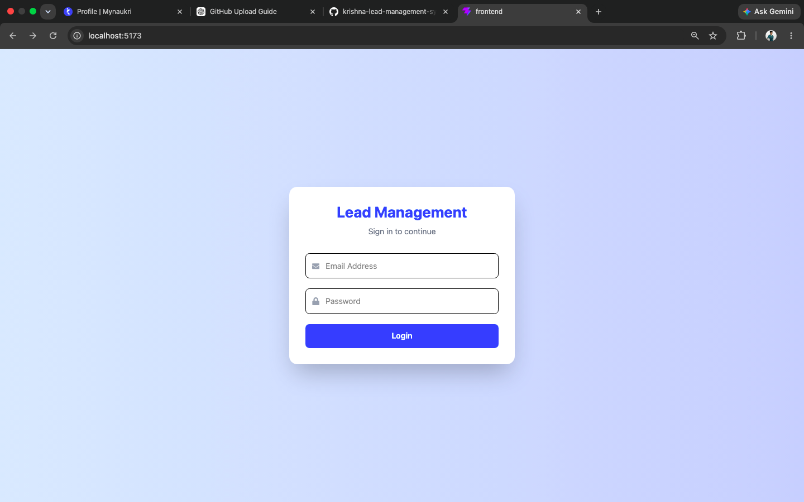
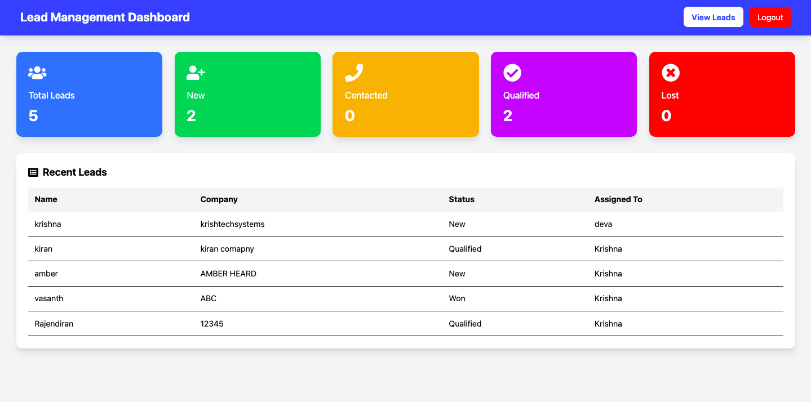

# Lead Management System (LMS)

A full-stack Lead Management System built using MERN stack with JWT authentication. This application helps manage sales leads efficiently with features like CRUD operations, filtering, search, and dashboard analytics.

---

## 🚀 Tech Stack

### Frontend
- React + TypeScript
- Vite
- Tailwind CSS
- Axios
- React Router DOM
- React Toastify

### Backend
- Node.js
- Express.js
- MongoDB Atlas
- Mongoose
- JWT Authentication
- bcrypt.js

---

## ✨ Features

- User Registration & Login
- JWT Authentication & Protected Routes
- Dashboard with lead statistics
- Create, Read, Update, Delete Leads
- Search leads by keyword
- Filter leads by status/source
- Responsive UI using Tailwind CSS
- Toast notifications for actions
- Basic loading UI support

---

## 📁 Project Structure


lead-management-system/
├── frontend/
│ ├── src/
│ ├── components/
│ ├── pages/
│ └── services/
│
├── backend/
│ ├── controllers/
│ ├── models/
│ ├── routes/
│ ├── middleware/
│ └── server.js


---

## 📦 Database Schema

### 👤 User Collection

```json
{
  "_id": "ObjectId",
  "name": "String",
  "email": "String (unique)",
  "password": "String (hashed)",
  "createdAt": "Date",
  "updatedAt": "Date"
}

📊 Lead Collection

{
  "_id": "ObjectId",
  "name": "String",
  "company": "String",
  "email": "String",
  "phone": "String",
  "source": "String",
  "status": "New | Contacted | Qualified | Won | Lost",
  "notes": "String",
  "createdAt": "Date",
  "updatedAt": "Date"
}

⚙️ Backend Setup
cd backend
npm install
npm run dev

Environment Variables

Create a .env file in backend folder:

PORT=5000
MONGO_URI=your_mongodb_atlas_connection_string
JWT_SECRET=your_secret_key

💻 Frontend Setup
cd frontend
npm install
npm run dev

🔗 API Endpoints
Auth APIs
 POST /api/auth/register
 POST /api/auth/login
Lead APIs
 GET /api/leads
 GET /api/leads/:id
 POST /api/leads
 PUT /api/leads/:id
 DELETE /api/leads/:id

 📊 Future Improvements
Pagination for large datasets
Role-based access control (Admin/User)
Email notifications
Export leads to CSV/PDF
Docker containerization
Swagger API documentation


## 📸 Screenshots

### Login Page


### Dashboard



🧪 Testing

You can test all APIs using Postman or any API testing tool.


👨‍💻 Author

Krishna